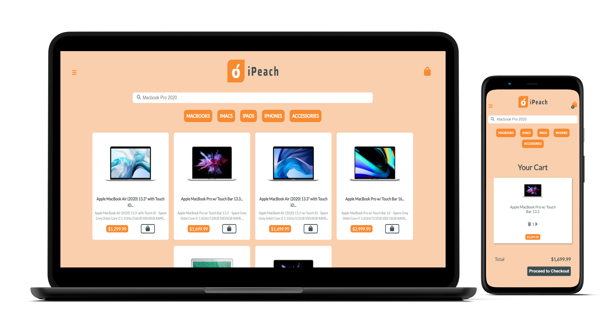

# iPeach e-commerce  

### This is an angular project made for fun.

### :electric_plug: Requeriments

- Node.JS >= 12.16.2
- NPM >= 6.14.4

### :camera: <a href="SCREENSHOTS.md">Click here to see the project screenshots</a>

### :computer: Getting started 
- npm i
- npm start
- [Start the backend](https://github.com/d-klotz/java-spring-ecommerce-backend)

:heavy_exclamation_mark: The project will start on port 4200

### <a href="http://linkedin.com/in/danielfelipeklotz">Contact me on LinkedIn</a>
